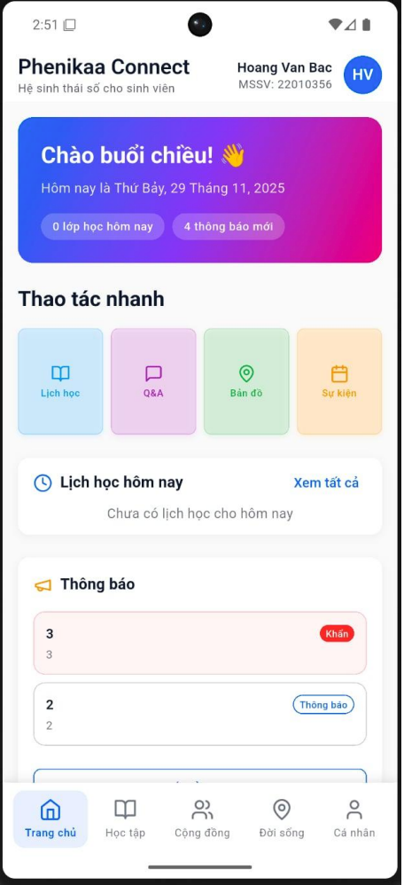
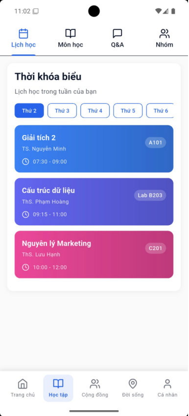
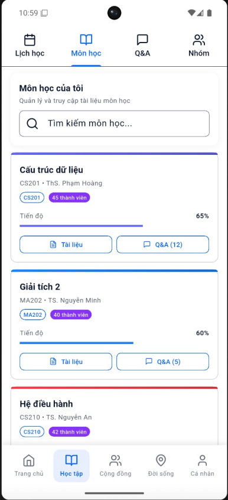

# 🏫 Phenikaa Connect

A dedicated digital ecosystem and social networking platform designed for Phenikaa University students. It provides an integrated hub to connect the student community, manage academic schedules, participate in student clubs, register for campus events, and share social content.

🌐 **Website:** [phenikaa-connect.vercel.app](https://phenikaa-connect.vercel.app)

---

[](https://flutter.dev)
[](https://dart.dev)
[](https://supabase.com)
[](LICENSE)

---

## 📋 Table of Contents

- [Introduction](#-introduction)
- [Visual Demo](#-visual-demo)
- [Key Features](#-key-features)
- [System Architecture & Tech Stack](#-system-architecture--tech-stack)
- [Getting Started](#-getting-started)
- [Usage & Core Workflows](#-usage--core-workflows)
- [API & Database Reference](#-api--database-reference)
- [Running Tests](#-running-tests)
- [Deployment](#-deployment)
- [Troubleshooting & FAQ](#-troubleshooting--faq)
- [Contributing](#-contributing)
- [Development Team & Contact](#-development-team--contact)
- [References](#-references)

---

## 🎯 Introduction

**Phenikaa Connect** bridges the gap between academic management and campus social life. Built specifically for Phenikaa University, it empowers students with:
*   **Centralized Academic Hub:** Check schedules, deadlines, courses, and participate in academic Q&A.
*   **Interactive Campus Feed:** Connect with classmates, share posts, and interact through comments, likes, and shares.
*   **Clubs & Event Registrations:** Easily browse official university clubs, join activities, and register/RSVP for events.
*   **Real-time Notifications:** Receive updates directly from the university administration or club leaders.

---

## 📱 Visual Demo

Here is an overview of the main user interface screens of Phenikaa Connect:

<p align="center">
  
  
  
</p>

<p align="center">
  <em>From left to right: Home Screen, Academic - Schedule Screen, Academic - Courses Screen</em>
</p>

---

## ✨ Key Features

### 🎓 Academic Management
- [x] **Timetable & Class Schedules:** View schedules, subjects, classrooms, and instructors.
- [x] **Study Groups:** Create or join peer study groups for specific courses.
- [x] **Course Tracking:** Keep track of progress and question Q&A forums for each course.
- [x] **Class Reminders:** Automatic notifications for upcoming classes.

### 👥 Social Interaction
- [x] **Interactive Feed:** Create, edit, and share posts with images.
- [x] **Interactions:** Like, comment, and share peer posts.
- [x] **Student Profiles:** Customize profile data (avatar, major, student ID, contact info).

### 🎪 Clubs & Events Hub
- [x] **Club Directory:** Browse university clubs, details, members, and posts.
- [x] **Events Feed:** Browse upcoming events, search by category, and RSVP.
- [x] **Event Creation:** Club Leaders and Admins can create and manage event registrations.

### 📢 Notifications Center
- [x] **Real-time Alerts:** Push notifications for post interactions, answers to Q&A, and event registrations.
- [x] **Official Announcements:** Direct broadcast updates from the University Administration.

### 👨‍💼 Administration & Roles
- [x] **Role-based Access:** Student, Club Leader, and Admin role enforcement.
- [x] **Event Moderation:** Admin approvals for club events and activities.
- [x] **Dashboard:** Club Management and Announcement creation.

---

## 🏗️ System Architecture & Tech Stack

### High-Level Architecture
Phenikaa Connect uses a clean architecture frontend connected to **Supabase Backend-as-a-Service (BaaS)**:

```
┌─────────────────────────────────────────────────────────────────┐
│                     Flutter Client Application                  │
│            (Android, iOS, Web, Windows, macOS, Linux)           │
├───────────────────────┬───────────────────────┬─────────────────┤
│    UI Layer           │ State Management      │ Routing         │
│    (Screens & Widgets)│ (Provider Pat.)       │ (go_router)     │
└───────────┬───────────┴───────────┬───────────┴───────────┬─────┘
            │                       │                       │
            ▼                       ▼                       ▼
┌─────────────────────────────────────────────────────────────────┐
│                       Supabase Backend Services                 │
├───────────────────────┬───────────────────────┬─────────────────┤
│  Authentication       │  PostgreSQL Database  │ Storage Bucket  │
│  (Email/Pass Signin)  │  (Tables, RLS)        │ (Images/Media)  │
└───────────────────────┴───────────────────────┴─────────────────┘
```

### Detailed Tech Stack

| Component | Technology | Version | Purpose |
|---|---|---|---|
| **Core Framework** | Flutter | ^3.9.2 | Multi-platform application framework |
| **Language** | Dart | ^3.9.2 | Programming language |
| **State Management**| Provider | ^6.1.2 | Local & global state management |
| **Navigation** | go_router | ^14.2.7| Declarative navigation routing |
| **API Client** | HTTP / Dio | ^1.2.2 / ^5.7.0 | Networking clients for additional services |
| **Database/BaaS** | Supabase | ^2.5.6 | Authentication, Database storage, and file hosting |
| **Local Storage** | SharedPreferences | ^2.3.2 | Device local key-value storage |
| **UI Components** | Lucide Icons, Shimmer| ^0.257.0 / ^3.0.0 | Icon package & loading animations |
| **Utilities** | intl, uuid, file_picker | ^0.19.0 / ^4.5.1 / ^8.0.0 | Format date-time, generate IDs, file picker |

### Project Directory Structure
```
PhenikaaConnect/
├── android/                 # Android platform specific configs
├── ios/                     # iOS platform specific configs
├── web/                     # Web platform files & configs
├── windows/                 # Windows build configs
├── macos/                   # macOS build configs
├── linux/                   # Linux build configs
├── test/                    # Unit & Widget tests
├── pubspec.yaml             # Flutter package dependencies
└── lib/                     # Main application source code
    ├── main.dart            # Entry point of the app
    ├── config/              # Configuration (Supabase initialization, API URL keys)
    │   └── supabase_config.dart
    ├── constants/           # Global themes, colors, and asset paths
    │   ├── app_constants.dart
    │   └── app_theme.dart
    ├── models/              # Clean schema data models
    │   ├── course.dart      # Course & ClassSchedule models
    │   ├── event.dart       # Event, Location, Club, ClubMember models
    │   ├── post.dart        # Post, Question, StudyGroup models
    │   └── user.dart        # User role (Admin, Club Leader, Student)
    ├── providers/           # Provider State Management logic
    │   └── app_provider.dart
    ├── screens/             # UI Screen Widgets (over 40+ screens)
    │   ├── auth_wrapper.dart
    │   ├── signup_screen.dart
    │   ├── social_screen.dart
    │   ├── academic_screen.dart
    │   ├── announcements_screen.dart
    │   └── admin_event_management_screen.dart
    ├── services/            # Services executing database queries
    │   ├── supabase_service.dart     # Supabase Auth, DB & Bucket actions
    │   ├── admin_service.dart        # Admin moderation DB queries
    │   ├── club_leader_service.dart  # Club management logic
    │   └── group_reminder_service.dart# Study group reminders
    └── widgets/             # Reusable general widgets
        ├── common_widgets.dart
        └── question_form_sheet.dart
```

---

## 🚀 Getting Started

### Prerequisites

Ensure you have the following installed on your machine:
*   [Flutter SDK](https://docs.flutter.dev/get-started/install) (Version `>= 3.9.2`)
*   [Dart SDK](https://dart.dev/get-started) (Version `>= 3.9.2`)
*   Xcode (Required for iOS builds, macOS only)
*   Android Studio / VS Code with Dart & Flutter Extensions
*   Supabase Account (Free tier works perfectly)

### 1. Clone the Repository
```bash
git clone https://github.com/baoo694/PhenikaaConnect.git
cd PhenikaaConnect
```

### 2. Install Packages
Run the following command to download dependencies:
```bash
flutter pub get
```

### 3. Supabase Configuration
1. Open your Supabase console and create a new project.
2. Under project settings, fetch your **API URL** and **Anon Key**.
3. Create the file `lib/config/supabase_config.dart` and add your credentials:
```dart
// lib/config/supabase_config.dart

import 'package:supabase_flutter/supabase_flutter.dart';

class SupabaseConfig {
  static const String supabaseUrl = 'https://YOUR_PROJECT_ID.supabase.co';
  static const String supabaseAnonKey = 'YOUR_SUPABASE_ANON_KEY';
  
  static Future<void> initialize() async {
    await Supabase.initialize(
      url: supabaseUrl,
      anonKey: supabaseAnonKey,
    );
  }
}
```

### 4. Running the App
Start a simulator/emulator or connect a physical device, then run:
```bash
# Run on the default active device/emulator
flutter run

# Run on Google Chrome (Web target)
flutter run -d chrome

# Target specific platforms
flutter run -d android
flutter run -d ios
```

---

## 📋 Usage & Core Workflows

### Student Flow
1. **Register/Login:** Sign up using your Phenikaa student email.
2. **Setup Profile:** Specify your Year, Major, Student ID, and upload an avatar.
3. **Check Schedules:** View daily class timetables and locations.
4. **Interact:** Post status updates, ask homework Q&A questions, or register for study groups.

### Club Leader Flow
1. Login with an account flagged with the `clubLeader` role.
2. Access the **Club Management Portal**.
3. Create club announcements, register new club events, and manage members.

### Admin Flow
1. Login with an account flagged with the `admin` role.
2. Access the **Admin Dashboard** to review and approve club events, send university announcements, or moderate posts.

---

## 🔌 API & Database Reference

Phenikaa Connect communicates directly with Supabase via PostgreSQL tables. The following models outline the database structure:

### Database Models

#### 1. `users`
Represents the system authentication and profiles metadata.
*   `id` (String, PK) - Unique user ID from Supabase auth.
*   `name` (String) - Full name.
*   `student_id` (String) - Student Registration ID.
*   `major` (String) - Department study major.
*   `year` (String) - Year of study.
*   `email` (String) - Student email.
*   `phone` (String) - Phone number.
*   `avatar_url` (String, Optional) - Storage bucket link to avatar image.
*   `role` (String) - User role permissions: `user`, `club_leader`, `admin`.
*   `account_status` (String) - Status: `active`, `suspended`.
*   `is_locked` (Boolean) - Lockout flag.
*   `metadata` (JSON) - Extra fields.

#### 2. `posts`
Social updates shared by users.
*   `id` (String, PK) - Post ID.
*   `author` (String) - Author name.
*   `major` (String) - Author major.
*   `avatar` (String) - Author avatar URL.
*   `time` (String) - Timestamp string.
*   `content` (String) - Post body content.
*   `image_url` (String, Optional) - Post image attachment URL.
*   `likes` (Integer) - Like count.
*   `comments` (Integer) - Comment count.
*   `shares` (Integer) - Share count.
*   `user_id` (String, FK) - Link to author.

#### 3. `questions`
Academic queries created in course pages.
*   `id` (String, PK) - Question ID.
*   `course` (String) - Code or name of course.
*   `title` (String) - Question heading.
*   `content` (String) - Description.
*   `author` (String) - Poster name.
*   `replies` (Integer) - Answers count.
*   `solved` (Boolean) - Marked solved flag.
*   `time` (String) - Timestamp.
*   `user_id` (String, FK) - Poster user ID.

#### 4. `study_groups`
Collaborative study schedules.
*   `id` (String, PK) - Study group ID.
*   `name` (String) - Group name.
*   `course` (String) - Academic course name.
*   `members` (Integer) - Number of members.
*   `max_members` (Integer) - Allowed capacity.
*   `meet_time` (String) - Time details.
*   `location` (String) - Classroom or study location.
*   `description` (String) - Goal description.
*   `member_ids` (List of Strings) - List of member user IDs.
*   `creator_id` (String) - Owner user ID.

#### 5. `events`
Campus activities open to students.
*   `id` (String, PK) - Event ID.
*   `title` (String) - Event title.
*   `description` (String, Optional) - Details.
*   `date` (String) - Date.
*   `time` (String) - Start and end time.
*   `location` (String) - Physical location.
*   `organizer` (String) - Host organizer.
*   `attendees` (Integer) - Current attendees RSVP.
*   `max_attendees` (Integer, Optional) - Ticket capacity limits.
*   `category` (String) - Category tags.
*   `image` (String) - Header banner image.
*   `club_id` (String, Optional, FK) - Hosting club ID.
*   `status` (String) - Approval status: `pending`, `approved`, `rejected`.

#### 6. `clubs`
University student organizations.
*   `id` (String, PK) - Club ID.
*   `name` (String) - Club name.
*   `members_count` (Integer) - Active members.
*   `category` (String) - Category.
*   `description` (String) - About description.
*   `active` (Boolean) - Status flag.
*   `leader_id` (String, FK) - Club leader user ID.

---

## 🧪 Running Tests

Execute Flutter test suites (unit tests and widget tests):
```bash
# Run all tests in the test/ directory
flutter test

# Run a specific test file
flutter test test/my_widget_test.dart
```

---

## 🚢 Deployment

### Android
Generate a release package (APK or Android App Bundle):
```bash
# Compile release APK
flutter build apk --release

# Compile Android App Bundle (AAB) for Google Play Store upload
flutter build appbundle --release
```

### iOS
Compile the release bundle (requires macOS & Xcode):
```bash
# Compile archive
flutter build ipa --release
```

### Web
Build release static files (located in `build/web/` folder):
```bash
flutter build web --release
```

---

## 🔧 Troubleshooting & FAQ

### Common Issues

#### 1. Supabase Initialization Error
*   **Issue:** The app hangs or crashes on launch, throwing `Supabase has not been initialized`.
*   **Solution:** Verify you have created the configuration file `lib/config/supabase_config.dart` with correct URL/Keys. Ensure `WidgetsFlutterBinding.ensureInitialized()` is called in `main.dart` before Supabase initialization.

#### 2. CocoaPods installation failures (iOS only)
*   **Issue:** Xcode build fails with CocoaPods errors.
*   **Solution:** Clean cache and reinstall pods:
    ```bash
    cd ios
    pod deintegrate
    pod cache clean --all
    pod install
    cd ..
    flutter clean
    flutter run
    ```

#### 3. Keystore errors on Android release builds
*   **Issue:** Build fails when executing `flutter build apk --release`.
*   **Solution:** Configure Android signing credentials in your local `android/key.properties` file or bypass signature checks for dev test APKs.

---

## 🤝 Contributing

We welcome all contributions! To collaborate on this project:

1. **Fork** the project.
2. **Create** your feature branch (`git checkout -b feature/AmazingFeature`).
3. **Commit** your changes following conventional commits (`git commit -m 'Add some AmazingFeature'`).
4. **Push** to the branch (`git push origin feature/AmazingFeature`).
5. **Open** a Pull Request.

Ensure your code passes the linter checklist before committing:
```bash
flutter analyze
```

---

## 👥 Development Team & Contact

*   **Development Group:** Team N01 - CSE703014, Phenikaa University.
*   **Project Repository:** [github.com/baoo694/PhenikaaConnect](https://github.com/baoo694/PhenikaaConnect)
*   **Project Demo Portal:** [phenikaa-connect.vercel.app](https://phenikaa-connect.vercel.app)

---

## 📚 References

*   [Flutter Documentation](https://flutter.dev/docs)
*   [Supabase Dart/Flutter SDK Guide](https://supabase.com/docs/reference/dart/initializing)
*   [Provider State Management](https://pub.dev/packages/provider)
*   [go_router Declarative Routing](https://pub.dev/packages/go_router)

---

**Disclaimer:** This is an academic project. Some features might be under active development and data might reset during database staging updates.
